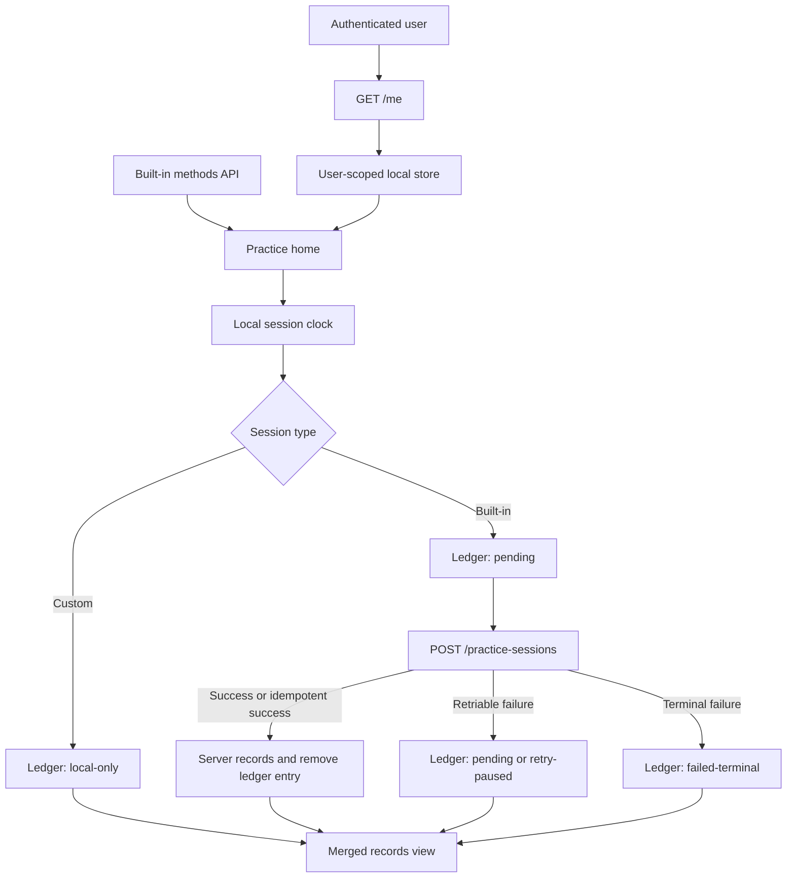

# Easy Meditation Mobile Prototype Fidelity Design

Date: 2026-07-10

Status: Approved. Implementation plan: `docs/superpowers/plans/2026-07-10-mobile-prototype-fidelity.md`.

## Goal

Rebuild the Expo mobile presentation layer so the app faithfully matches the repository's interactive Web prototype while preserving the production-shaped authentication, API, and session-clock foundations already in the mobile app.

This pass covers every current mobile screen and restores the prototype's missing core interactions. The result must feel like one coherent product on iOS and Android, not a native app with a loosely similar color palette.

## Approved Decisions

- Use the repository Web prototype as the visual and interaction source of truth.
- Use a native React Native implementation. Do not wrap the Web prototype in a WebView.
- Restyle and complete all current mobile screens, not only the practice home screen.
- Keep login and registration behavior and copy, but redesign them in the prototype's visual language because the Web prototype has no auth screens.
- Restore the guide, custom rhythm, quick duration editing, sound toggle, pause/resume/end, and replay interactions.
- Store the new custom rhythm and display preferences locally for this pass. Do not add backend custom-rhythm or settings endpoints.
- Treat iOS and Android as equal-priority targets. Only safe-area, status-bar, and native shadow rendering may differ slightly.

## Source Of Truth

The user explicitly selected the repository Web prototype as the final baseline:

- `index.html`
- `src/ui/app.js`
- `src/ui/app-state.js`
- `src/styles.css`
- `src/assets/reference-style/`

The Web prototype supplies the complete visual system and the practice, guide, custom-rhythm, focus-session, and records states. The original external QQ JPG recorded in `design-qa.md` is not present in this checkout and is not required for this pass because the Web prototype was explicitly approved as the baseline.

The primary reference viewport is `390x844`. A `412x915` Android viewport is the equal-priority companion baseline.

## Scope Relationship To The Earlier Mobile Design

`docs/superpowers/specs/2026-07-07-mobile-backend-app-design.md` remains the long-term product architecture. This fidelity pass intentionally narrows two earlier server-owned concepts:

- The custom rhythm is local-only in this pass.
- Duration and sound preferences are local-only in this pass.

Server synchronization for those items remains future work. Authentication, built-in methods, practice-session submission, and server records continue to use the existing API.

## Architecture

Keep the existing monorepo, Expo Router, TanStack Query, Zustand, SecureStore, shared schemas, Fastify API, and session clock. Replace screen-specific visual approximations with a small native design layer shared across the app.

### Routes

Keep:

- `apps/mobile/app/(auth)/login.tsx`
- `apps/mobile/app/(auth)/register.tsx`
- `apps/mobile/app/(tabs)/practice.tsx`
- `apps/mobile/app/(tabs)/records.tsx`
- `apps/mobile/app/session/[methodId].tsx`

Add:

- `apps/mobile/app/guide.tsx`
- `apps/mobile/app/custom-rhythm.tsx`

The custom rhythm starts a session through `/session/custom`. The session screen resolves `custom` from the local preference store and resolves all other method IDs from the built-in methods API.

### Shared UI Units

Create focused units under `apps/mobile/src/components/`:

- `PrototypeScreen`: gradient, safe area, responsive content width, and scroll behavior.
- `AppText`: display/body font selection and controlled text scaling.
- `PrototypeIconButton`: real source assets, 44x44 minimum target, and consistent hit slop.
- `ModeCard`: title, rhythm, purpose, duration trigger, decoration, and optional settings action.
- `DurationPopover`: a compact 1-60 minute editor anchored to a built-in mode card.
- `BeforeStartCard`: guide entry, source illustration, and dismiss action.
- `BottomPillNav`: the centered text-only prototype navigation, installed as the custom `tabBar` for Expo Router so route state has one owner.
- `PrototypeButton`: primary and quiet action styles.
- `ScrollWheelPicker`: accessible custom-rhythm value editing that reproduces the Web prototype's wheel control.
- `BreathingCanvas`: the native organic breathing renderer.
- `InlineState`: loading, empty, warning, and retry presentation.

Each unit owns one visual or interaction responsibility. Screens compose them without duplicating token values.

### Authenticated Data Boundary

Add an `AuthSessionBoundary` above the authenticated routes. It must complete `/me`, select the user-scoped local store, and only then mount practice/records content.

Use authenticated TanStack Query keys shaped as `['user', userId, resource, ...params]`. Public built-in-method queries may remain global. On logout, terminal 401, or an account ID change, cancel in-flight queries for the previous `userId`, remove that user's query cache, and unload that user's local store before rendering another account. A failed refetch must never fall back to another account's cached stats or records.

## Visual System

### Tokens

Use the reference values from `src/styles.css`:

| Token | Value | Purpose |
| --- | --- | --- |
| Ink | `#111622` | Primary text |
| Muted | `#6d7483` | Secondary text |
| Background top | `#f0f2ff` | Gradient start |
| Background middle | `#e9fbfb` | Gradient middle |
| Background bottom | `#f6f7f9` | Gradient end |
| Lilac | `#ece0f7` | Box breathing card |
| Periwinkle | `#e0e6ff` | Long-exhale card |
| Blue | `#dfe9fb` | Equal-breathing card |
| Mint-blue | `#d4eef6` | Custom card |
| Active nav | `#a8e8e0` | Selected pill |
| Teal | `#0b717a` | Accent text and controls |

Port the prototype's measured radii, spacing, shadows, icon dimensions, and type sizes into `apps/mobile/src/theme/tokens.ts`. Do not tune screens with independent near-match values.

### Typography

Bundle LXGW WenKai Regular and Medium with the app for consistent Simplified Chinese rendering on iOS and Android. The project is distributed under SIL OFL 1.1 and permits app embedding; keep its license file with the font assets. Use Medium for display headings and cards, Regular for descriptive copy, and the platform sans font for email addresses, password fields, and tabular timer digits. See the [official font repository](https://github.com/lxgw/LxgwWenKai).

Text scaling must remain enabled. Layouts must support font scaling through 1.2 without clipped controls or unreadable overlap. Fidelity is judged at the default system font scale.

### Assets And Icons

Use the source files already under `apps/mobile/assets/reference-style/` for back, info, gear, sound, petals, and dandelion art. Do not substitute Ionicons when a source asset exists. Use the closest installed icon-library glyph only for controls with no source asset.

Load the sound SVG files through native SVG support or produce lossless raster derivatives from those exact sources. Keep the original SVGs and the deterministic conversion step; do not redraw the icons.

### Method Presentation Adapter

API data remains authoritative for phase timing, default duration, availability, and session execution. A mobile presentation adapter is authoritative for the exact prototype-facing copy, order, purpose, and art:

| API stable ID | Display title | Rhythm label | Purpose | Asset | Order |
| --- | --- | --- | --- | --- | --- |
| `box` | `盒式呼吸法` | `4-4-4-4` | `放松` | `petal-box.png` | 1 |
| `four-seven-eight` | `长呼气` | `4-7-8` | `睡眠` | `petal-sleep.png` | 2 |
| `coherent` | `等量呼吸法` | `5-0-5` | `专注` | `petal-focus.png` | 3 |
| local `custom` | `自定义` | current `inhale-hold-exhale` | empty | `petal-box.png` | 4 |

New practice-session snapshots use the display title so records preserve what the user saw. If one of the three mapped API methods is missing, preserve its grid position as a disabled unavailable card and show a quiet refresh warning. Ignore unrecognized extra API methods in this fidelity pass rather than breaking the approved 2x2 composition.

### Layout

- Use `390x844` as the primary measurement surface.
- Support portrait widths from 360 through 430 with fixed typography and responsive gutters/gaps rather than scaling the entire screen.
- Constrain content width on tablets instead of stretching cards.
- Match prototype hierarchy, card proportions, artwork placement, and bottom-nav width.
- Keep all important controls outside status-bar and gesture areas on both platforms.

### Breathing Motion

Replace the three-circle approximation with `@shopify/react-native-skia`, installed through the Expo-compatible installer. [Expo documents Skia](https://docs.expo.dev/versions/latest/sdk/skia/) as supported on Android and iOS and included in Expo Go. Port the Web Canvas renderer's shape, glow, phase progression, and transition parameters rather than inventing a new orb.

Use Reanimated/shared values only to drive the Skia renderer. The authoritative clock remains independent of frame rate. Reduced-motion users receive a lower-amplitude, slower transition rather than a fully static state that obscures phase changes.

## Screen Behavior

### Login And Registration

- Preserve existing validation, API calls, loading states, links, and copy.
- Use the prototype gradient, embedded display font, white translucent fields, source dandelion mark, and shared action components.
- Keep email/password content in the system sans font.
- Show field and request errors inline without a modal.

### Practice Home

- Render three built-in API methods plus one local custom card in a 2x2 grid.
- Match the prototype header, exact heading copy, source decorations, card order, card proportions, and centered bottom navigation.
- Open `DurationPopover` from each built-in duration label and persist a 1-60 minute override for built-in IDs only.
- The custom card reads `customRhythm.durationMinutes`; tapping its card, duration, or gear action opens the custom-rhythm editor. `durationOverrides` never contains `custom`.
- Open the guide from the info icon and before-start card.
- Allow the before-start card to be dismissed and remember that state locally.

### Guide

- Port the Web prototype's guide copy and section order.
- Use the shared header, source back asset, and the same scroll rhythm as the prototype.
- Back always returns to the prior practice-home state.

### Custom Rhythm

- Edit one local custom rhythm with the Web prototype's three scroll wheels.
- Keep inhale, hold, and exhale within `1-12` seconds. All three phases remain present.
- Keep target duration to the prototype choices `2`, `3`, `5`, and `10` minutes.
- Keep the aggregate cycle wheel within `3-36` seconds and redistribute its value across the three phases with the Web prototype's existing algorithm.
- Persist every valid wheel change immediately; back keeps the latest valid values, so no separate save action exists.
- Add one `开始呼吸` primary button below the source picker panel. This is an approved functional extension because the Web state exposes `startCustomSession` but its rendered page omits the wired start control. The button uses `PrototypeButton`; all other custom-page geometry remains prototype-backed.

### Focus Session

- Resolve built-in methods from the API and the custom method from local state.
- Apply a saved duration override to built-in methods. A custom session always uses the single `customRhythm.durationMinutes` field selected from `2`, `3`, `5`, or `10`.
- Preserve wall-clock-based start, pause, resume, phase, remaining-time, and completion behavior.
- Generate and commit four PCM WAV cue files from the exact oscillator ranges and gain envelope in `src/domain/audio.js`: inhale `392→587 Hz / 0.42s`, hold `523 Hz / 0.32s`, exhale `440→294 Hz / 0.50s`, and completion `440→660 Hz / 0.68s`. Keep the deterministic generator script with the assets.
- Preload those cue files and play them with `expo-audio` when sound is enabled.
- Match the prototype's ready, running, paused, and completed layouts.
- Provide sound toggle, pause/resume, intentional end, replay, and return actions.
- A built-in session submits to the existing API on completion or intentional end.
- A custom session remains local-only and appears in the device's records view.
- Ending before one practiced second returns without creating a record because the existing API requires `actualDurationSeconds >= 1`.
- Intentional ends after one second use `completed: false`; natural completion uses `completed: true`.
- Replay creates a fresh clock, timestamps, and `clientSessionId` while keeping the selected method, duration, and sound setting.

### Session Exit Guard

Install one route-removal guard that covers header back, Android hardware back, iOS back gesture, tab changes, and programmatic/deep-link navigation while the focus route is mounted. Disable the native swipe-back gesture so removal cannot finish before persistence.

- Idle: allow navigation immediately and create no record.
- Running or paused explicit `结束训练`: persist the intentional-end ledger entry first, then navigate back.
- Running or paused system/navigation exit: show a prototype-styled confirmation with `继续练习` and `结束并离开`; the end action uses the same persistence-first pipeline.
- Completed: persist the completed ledger entry before the first POST; return/replay controls unlock after that local write succeeds, without waiting for the network response.

After the awaited local write, replay stays on the route with a fresh session identity; an approved exit dispatches the originally blocked navigation action. A failed local write keeps the user on the session screen and exposes retry instead of silently losing the practice.

### Records

- Fetch the existing summary and up to 50 server sessions from the existing endpoints.
- Merge server sessions with every `localSessionLedger` state by `clientSessionId`.
- Bucket `endedAt` into device-local calendar days and build the 28-day heatmap from the merged session list using practiced minutes, not session count.
- Derive the displayed streak from those same device-local day buckets. If a 50-record response truncates a streak that reaches the oldest returned day, render the result as a lower bound such as `12+` instead of claiming an exact value.
- Preserve server total-session, total-seconds, and rolling-seven-day values, then add deduplicated ledger values that are not present in the fetched session list.
- Match the Web prototype's hierarchy, recent rows, empty state, and calendar density.
- The existing 50-session API limit is accepted for this pass. If the server returns exactly 50 sessions, show a quiet `基于最近 50 条记录` qualifier near the calendar. A dedicated server heatmap endpoint is out of scope, so the heatmap is explicitly a recent-record estimate in that case.

## Local Data And Submission Flow

Use `@react-native-async-storage/async-storage` with Zustand persistence for non-secret local data. Keep refresh tokens in SecureStore.

Namespace local state by authenticated user ID, obtained from the existing `/me` endpoint, so one account never sees another account's custom rhythm or settings on the same device.

Use the storage key `easyMeditation.preferences.<userId>`. Do not read or write a global fallback key. If `/me` cannot identify the signed-in user, show a retry state before loading user-scoped practice data.

Persist:

- custom rhythm;
- duration overrides by method ID;
- sound enabled state;
- before-start-card dismissal;
- one local session ledger containing custom, pending, retry-paused, and terminal-failed records.

Store all not-yet-server-owned practice records in one user-scoped `localSessionLedger`. Each entry contains the complete existing `PracticeSessionCreateInput` snapshot plus `origin: custom | built_in` and one explicit state:

- `local-only`: custom record; never submitted.
- `pending`: built-in record eligible for automatic retry.
- `retry-paused`: built-in record that exhausted automatic retries; manual retry is available.
- `failed-terminal`: built-in record rejected by a non-retriable response; no automatic or manual retry is offered without changing the payload.

`pending` and `retry-paused` entries also store `attemptCount`, `nextAttemptAt`, and the latest safe error code. The ledger is the retry outbox; there is no second collection that can drift from it. Records and device totals include all four states once, deduplicated by `clientSessionId`. On server success, insert/refetch the server record and then remove the matching built-in ledger entry.

Documented defaults are one custom rhythm named `自定义` with `4s` inhale, `2s` hold, `5s` exhale, and `5` minutes; sound enabled; no built-in duration overrides; before-start card visible; and an empty local session ledger. Validate the hydrated payload with a mobile Zod schema before exposing it to screens.

Write a built-in record to the persisted ledger as `pending` before the first POST. Automatically retry only network failures, timeouts, HTTP `429`, and HTTP `5xx`. A `401` first runs the existing refresh flow; a terminal `401` leaves the entry `pending`, stops retries until authentication succeeds again, and returns to authentication. HTTP `400`, `404`, and `409` become `failed-terminal`: retain the practice as a visible local record, show `记录仅保存在本机`, and do not retry it.

Automatic retries run when the authenticated boundary mounts and before records calculation, subject to `nextAttemptAt`. Use delays of `5s`, `30s`, `5m`, and `30m`, then move the entry to `retry-paused` after five failed attempts and expose a manual retry action that resets the attempt count. Respect `Retry-After` for `429` when it is longer. Reuse `clientSessionId`; on either a new or idempotently existing success, update/refetch server data before removing the ledger entry and presenting totals.

## Error Handling

- Auth errors: field or form-level inline messages; retain typed non-password values.
- Methods failure with no data: centered retry state; never show a broken partial grid.
- Methods refresh failure with cached data: keep the current grid and show a quiet warning.
- Session method missing: offer a direct return to practice home.
- Audio load/play failure: keep the timer usable, disable sound only for that session, preserve the user's stored preference, and show one non-blocking note.
- Built-in submission failure: classify it into `pending`, `retry-paused`, or `failed-terminal`, keep the ledger record visible locally, and show the matching retry or local-only status.
- Records failure: show merged local data when present and provide retry for server data.
- Corrupt local state: validate on hydration, discard only the invalid slice, and fall back to documented defaults.
- Account change: render the authenticated bootstrap state until the new `/me`, new user-scoped store, and new user-keyed queries are ready; never render stale authenticated content between accounts.

## Accessibility

- Minimum interactive target: `44x44` logical points.
- Every icon-only action has an accessibility role, name, and state where relevant.
- Phase and completion changes use polite announcements and do not announce every animation frame.
- Text/background combinations must meet WCAG AA for normal text; decorative low-contrast petals are ignored by accessibility APIs.
- Keyboard avoidance and focus order must remain correct on both auth screens.

## Verification

### Automated

- Preserve the existing session-clock, API, shared-schema, and auth tests.
- Add unit tests for local-state hydration/validation, user namespacing, presentation mapping, duration overrides, custom phase resolution, retry classification/backoff, and record merging/deduplication.
- Add React Native component tests for duration editing, guide/dismiss actions, custom validation, sound state, session controls, error/retry states, and every session exit-guard path.
- Add account-isolation tests for `A → logout → B`, including offline bootstrap and failed-refetch cases, proving no A-owned local or TanStack Query data can render for B.
- Run workspace tests and type checking.

### Visual And Device QA

Add a deterministic visual-QA fixture mode that is excluded from production behavior. It supplies fixed API responses, fixed user-scoped local state, `now = 2026-07-10T12:00:00+08:00`, and explicit session phase/progress values. Use the same fixture content in the Web reference capture and native capture.

For each important route/state, capture the source Web prototype and the native implementation at equivalent fixture state:

- practice home;
- guide;
- custom rhythm, with the new start-button region treated as an approved extension rather than an exact source match;
- session ready;
- inhale, hold, exhale, and paused session states;
- completion;
- records empty and populated;
- login and registration, evaluated against this specification's approved tokens and shared components because the Web prototype has no auth screens.

Capture the Web reference at CSS pixel ratio `1`. Capture native images at device density, normalize them to logical-point `1x`, and crop or mask the OS status bar and gesture indicator before comparison. Align images on the safe-area content origin and horizontal center. Generate a 50%-opacity overlay plus a pixel-difference image for every pair and keep both with the accepted screenshots.

The Web reference keeps its declared KaiTi fallback while native uses the approved embeddable LXGW WenKai. Therefore glyph contours and exact word width are excluded from pixel-difference scoring. Font family class, weight, declared point size, line height, line wrapping, and text-block position remain acceptance criteria.

Also verify:

- no horizontal overflow at 360-430 widths;
- no clipped content at 1.2 font scale;
- performance on a Pixel 7 / Android API 34 target and iPhone 14 target using release-mode builds: warm up for 10 seconds, record a 60-second box-breathing session with Android `dumpsys gfxinfo framestats` and iOS Instruments Core Animation, require at least 55 average rendered frames per second and no run of three frames above 50ms;
- pause/background/resume timer accuracy;
- sound toggle and phase cues;
- offline completion retention and later retry;
- account isolation for local state.

For prototype-backed screens, use the normalized overlay to measure the bounding boxes of headers, cards, artwork, information panels, and navigation. Acceptance allows at most `4` logical pixels of position or size deviation for those primary elements and at most `2` logical pixels of declared type-size deviation at the baseline viewport. Token colors, source assets, copy, card count, and information hierarchy must match exactly. Glyph contours, platform-native shadow softness, masked status bars, and gesture indicators are excluded from these numeric tolerances.

## Acceptance Criteria

- The practice home is visibly faithful to the selected Web prototype at `390x844`, including header, exact heading, 2x2 card grid, source imagery, information card, and pill navigation.
- Every listed screen uses the same approved tokens, embedded font, assets, radii, and spacing system.
- iOS and Android retain the same information hierarchy and component geometry at their baseline viewports.
- Guide, custom rhythm, duration overrides, sound, start/pause/resume/end/replay, and records navigation work.
- Built-in session records remain server-backed; retriable failures are retained and retried without duplicates, while terminal failures remain visible as non-retrying local records.
- Custom rhythms, custom sessions, duration overrides, sound, and dismissal state persist locally and remain isolated by account.
- Authenticated API caches are keyed and cleared by user identity; an account switch never renders another account's data, including while offline or after a failed refetch.
- Existing authentication, API, and timer behavior continues to pass automated checks.
- Visual QA contains no unresolved high- or medium-impact mismatch on the required screens and states.

## Out Of Scope

- WebView or Capacitor packaging.
- New backend custom-rhythm or settings routes.
- Server synchronization of local custom sessions.
- Multiple saved custom rhythms.
- New courses, social features, subscriptions, achievements, or content libraries.
- A dedicated server heatmap endpoint.
- Tablet-specific information architecture; tablets use a constrained phone-width composition.
